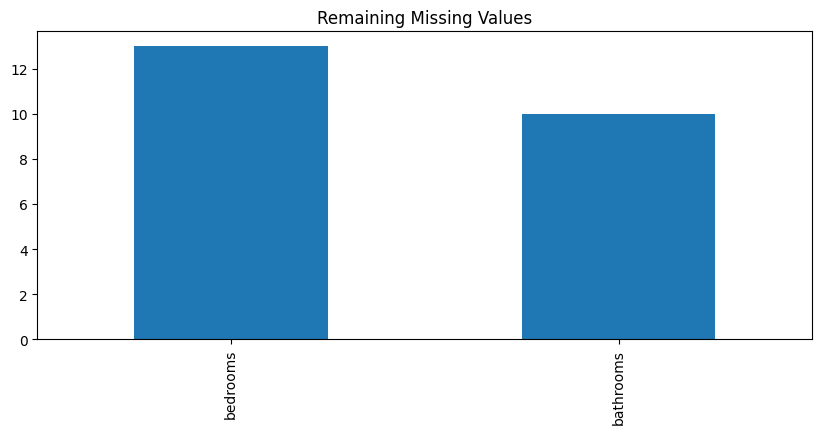
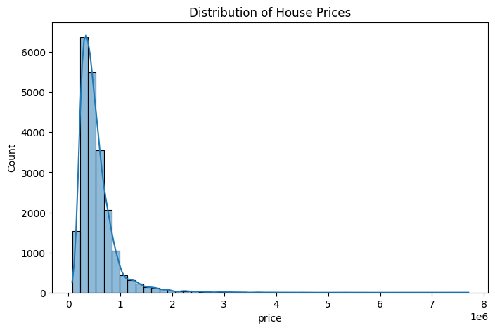
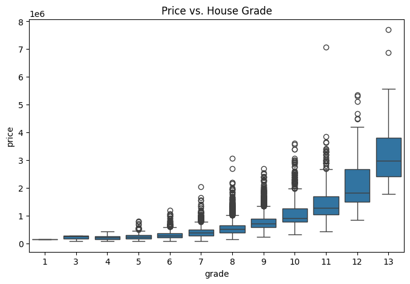
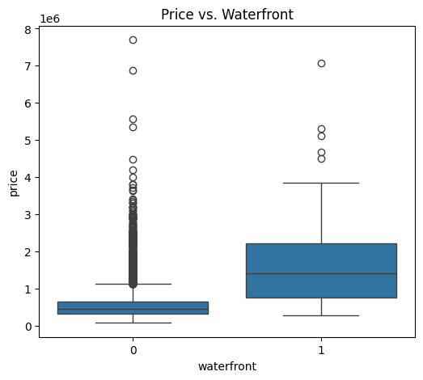
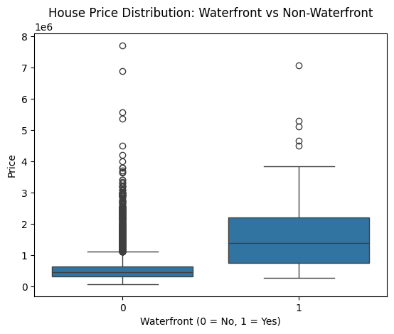
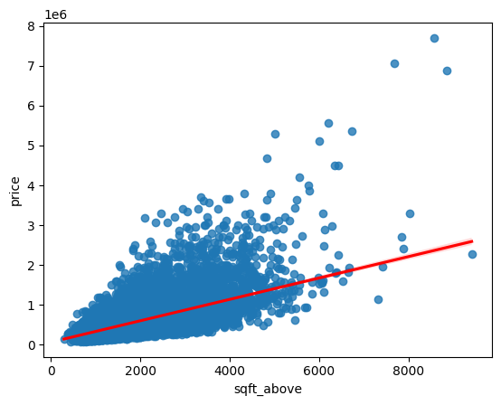
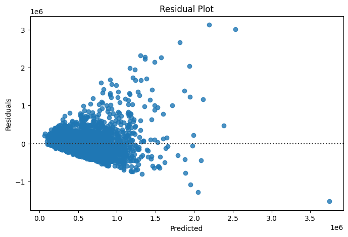
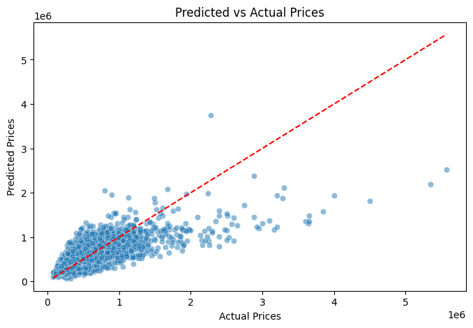

# 🏡 House Sales in King County, USA
🔗 Connect with me on [LinkedIn]([https://www.linkedin.com/in/YOUR-LINKEDIN-USERNAME/](https://www.linkedin.com/in/ghaith-kouki-4010a3329/))

## 📖 Overview
This project analyzes **house sales data in King County (Seattle area, USA)** to uncover key factors that influence housing prices.  
It includes:
- 🔹 **Data Cleaning & Wrangling**
- 🔹 **Exploratory Data Analysis (EDA)**
- 🔹 **Predictive Modeling with Machine Learning**
- 🔹 **Model Evaluation & Insights**

📓 Explore the full notebook here:  
[House_Sales_King_County_Final_With_Conclusions.ipynb](House_Sales_King_County_USA.ipynb)

---

## 📂 Dataset
The dataset contains **house sale prices** for King County, including Seattle.  
It covers sales between **May 2014 and May 2015**.

- 📊 **Rows:** ~21,600  
- 📑 **Columns:** 21 (price, bedrooms, bathrooms, sqft_living, waterfront, grade, condition, zipcode, etc.)  
- 📌 **Source:** [Kaggle - House Sales in King County, USA](https://www.kaggle.com/harlfoxem/housesalesprediction)

---

# ✅ Tasks Breakdown

## 📝 Task 1: Importing Data
- Load dataset with **Pandas**.
- Inspect dimensions, datatypes, and missing values.

📊 **Remaining Missing Values**  
  
🔎 **Conclusion:** Only a small number of missing values remained after cleaning.

---

## 🧹 Task 2: Data Wrangling
- Drop irrelevant columns (`id`, `Unnamed: 0`).
- Handle missing values.
- Fix datatypes.

---

## 📊 Task 3: Exploratory Data Analysis (EDA)
- Visualize distributions.
- Check correlations with price.
- Boxplots & regression plots.

📈 **Distribution of House Prices**  
  
🔎 **Conclusion:** House prices are right-skewed. Most are under $1M, but outliers exceed $5M.

🏠 **Price vs. House Grade**  
  
🔎 **Conclusion:** Better construction grades strongly correlate with higher prices.

🌊 **Price vs. Waterfront**  
  
🔎 **Conclusion:** Waterfront properties command a premium compared to non-waterfront homes.

🌊 **Waterfront vs. Non-Waterfront Count**  
  
🔎 **Conclusion:** Waterfront houses are rare, making them more valuable.

📐 **Regression: Price vs. Sqft Above**  
  
🔎 **Conclusion:** Larger living areas usually mean higher prices, though luxury homes break linear trends.

---

## 🤖 Task 4: Model Development
- Built **Linear Regression model** with `sqft_living` as main predictor.
- Train/Test split applied.

📉 **Residual Plot**  
  
🔎 **Conclusion:** Predictions are decent, but extreme values (luxury homes) have larger errors.

📊 **Predicted vs. Actual Prices**  
  
🔎 **Conclusion:** The model fits most homes well but underestimates expensive properties.

---

## 📏 Task 5: Model Evaluation & Refinement
- Metrics: **R²** and **RMSE**.
- Error distribution examined.

📉 **Error Distribution vs. Prediction Error**  
  
🔎 **Conclusion:** Errors cluster around zero, but luxury homes inflate variance.

---

# 🧠 Machine Learning Conclusion
Our **Linear Regression model** demonstrates that simple predictors like **sqft_living** capture much of the pricing trend. However:

- ✅ It achieves **good baseline accuracy** for most houses.
- ⚠️ It **struggles with outliers** — especially luxury homes priced above market norms.
- 📉 Error analysis shows **systematic underestimation** of expensive properties.

📌 **Next Steps for Improvement:**
- Use **Multiple Linear Regression** with more features (e.g., grade, location, waterfront).
- Apply **Regularization (Ridge/Lasso)** to prevent overfitting.
- Experiment with **Tree-Based Models (Random Forest, XGBoost)** for non-linear relationships.

---

## 📌 Requirements
- Python 3.7+  
- pandas, numpy, matplotlib, seaborn, scikit-learn, missingno  

## 📄 License
This project is licensed under the **MIT License**.
