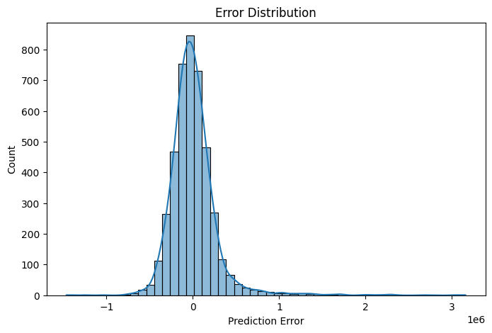

# 🏡 House Sales in King County, USA

## 🔎 Overview
This project analyzes **house sales data in King County (Seattle area, USA)** to understand the factors that influence housing prices.  
It covers:
- **Data wrangling** to clean and prepare the dataset.
- **Exploratory Data Analysis (EDA)** to visualize housing trends.
- **Machine learning modeling** to predict house prices.
- **Evaluation** of model performance using error analysis.

📓 You can view the full Jupyter Notebook here:  
[House_Sales_King_County_Final_With_Conclusions.ipynb](House_Sales_King_County_USA.ipynb)

---

## 📂 Dataset
The dataset contains house sale prices for King County, including Seattle.  
It includes homes sold between **May 2014 and May 2015**.

- **Source:** [Kaggle - House Sales in King County, USA](https://www.kaggle.com/harlfoxem/housesalesprediction)  
- **Rows:** ~21,600  
- **Columns:** 21 (e.g., price, bedrooms, bathrooms, sqft_living, waterfront, condition, grade, zipcode, etc.)

---

## ✅ Tasks

### Task 1: Importing Data
- Load the dataset using Pandas.
- Inspect dimensions, data types, and missing values.

**Remaining Missing Values**  
  
👉 **Conclusion:** Most missing values were handled successfully, with very few left in the dataset.

### Task 2: Data Wrangling
- Remove irrelevant columns (`id`, `Unnamed: 0`).
- Handle missing values (replace or drop).
- Ensure proper data types.

### Task 3: Exploratory Data Analysis (EDA)
- Visualize distributions of numerical features.  
- Correlation heatmap to identify relationships with price.  
- Scatterplots (e.g., price vs. sqft_living).  
- Boxplots (e.g., price vs. grade, price vs. waterfront).

**Distribution of House Prices**  
  
👉 **Conclusion:** Prices are right-skewed, with most homes under $1M and some very expensive outliers.

**Price vs. House Grade**  
  
👉 **Conclusion:** Houses with higher grades tend to have much higher prices, showing strong correlation.

**Price vs. Waterfront**  
  
👉 **Conclusion:** Waterfront houses are significantly more expensive than non-waterfront ones.

**Waterfront vs. Non-Waterfront Counts**  
  
👉 **Conclusion:** Only a small fraction of houses are waterfront, making them rare and premium.

**Regression: Price vs. Sqft Above**  
  
👉 **Conclusion:** Larger living area strongly correlates with higher price, but some luxury homes deviate from linearity.

### Task 4: Model Development
- Develop predictive models (e.g., Linear Regression).  
- Train/test split for evaluation.  
- Visualizations: residual plots, predicted vs. actual.

**Residual Plot**  
  
👉 **Conclusion:** Residuals scatter around zero but underestimate very high-priced houses.

**Predicted vs. Actual Prices**  
  
👉 **Conclusion:** The model predicts most homes well, though performance drops for luxury houses.

### Task 5: Model Evaluation & Refinement
- Evaluate with **R² Score** and **RMSE**.  
- Analyze error distribution.  
- Compare model performance.

**Error Distribution vs. Prediction Error**  
  
👉 **Conclusion:** Errors are centered near zero but skewed for high-priced homes, showing the model struggles with outliers.

---

## 🧠 Machine Learning Conclusion
- A simple linear regression model using `sqft_living` explains a significant portion of price variance.  
- More complex models (e.g., multiple regression, regularization, or tree-based models) could improve predictions.  
- Predictions for very high-priced homes remain difficult, suggesting **non-linear models** may perform better.  

---

## 📌 Requirements
- Python 3.7+  
- pandas, numpy, matplotlib, seaborn, scikit-learn, missingno  

(You can install them via `pip install -r requirements.txt`)

---

## 📄 License
This project is licensed under the MIT License.

---
